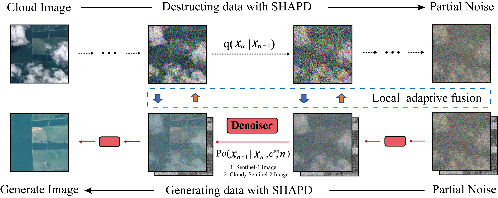

# SHAPDiff-CR

## Overview

This repository provides the implementation of **SHAPDiff-CR**, a Spatial Heterogeneity-Aware Partial Diffusion model for SAR-assisted optical image cloud removal.

  

  <b>Overview of the proposed SHAPDiff-CR framework.</b>

Existing diffusion-based cloud removal methods generally apply a similar generative process to regions with different cloud contamination levels. In contrast, SHAPDiff-CR introduces a spatial heterogeneity-aware partial diffusion process, together with local adaptive fusion, to preserve reliable observations while progressively reconstructing cloud-obscured regions.
